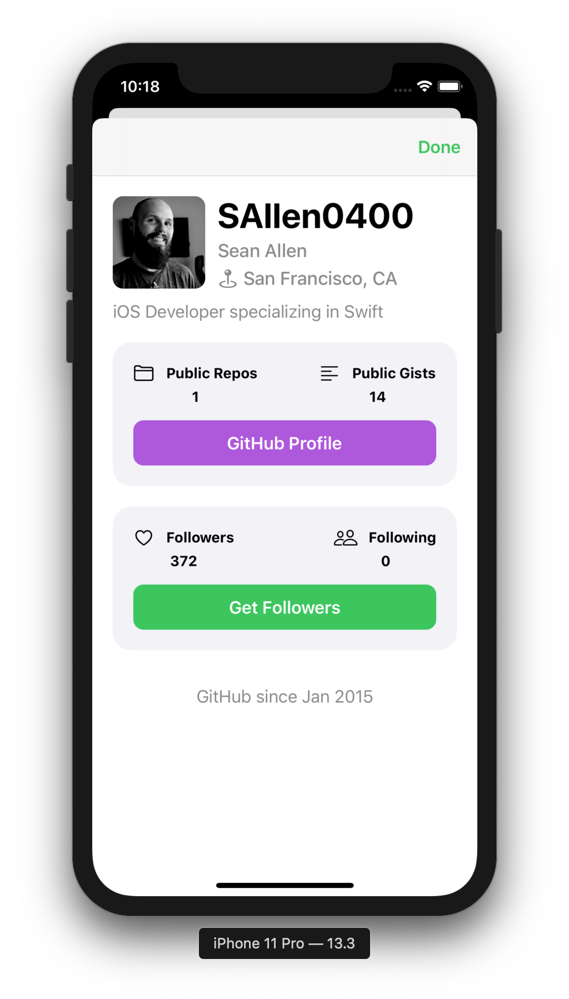
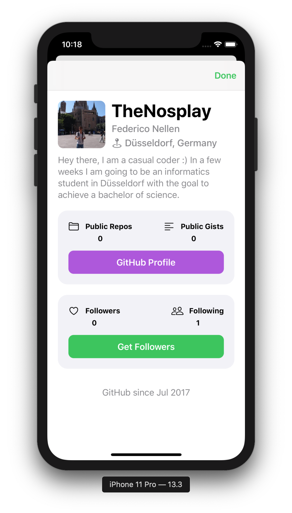

# takehomeproject - GitHubFollowers

## The Project

This project is based on the course of @[Sean Allen](https://github.com/SAllen0400). It is an app that pulls the followers of an user from GitHub and displays them in a CollectioView. The Data is managed through a DiffableDateScource, which allows an animated search functionallity. When tapping on a cell, anew screen opens and displays the user information. This contains the users loginname, name, location and their biography. Furthermore it shows the public repos gists and the users number of followers and following. The screen has two buttons. One of them displays the GitHub profile in a SafariView and the other button shows a collectionView of the users followers.
The user of the app has the possibility to save GitHub users local on their device. These get displayed in a TableView. 

My changes to the project are: the dynamic height of the GFUserInfoVC using preferredContentSize and the dynamic apating ScrollView height in the UserInfoVC. 

## Sneak Peak


20.02.2020
My changes are not refactored and not clean. Working on it.

## Images

Short User Biography             |  Long User Biography
:-------------------------:|:-------------------------:
  |  

## The code I used

The code to calculate the height of a UILabel. Found this on [StackOverflow](https://stackoverflow.com/questions/25180443/adjust-uilabel-height-to-text)

```swift
static func heightForUILabel(text:String, font:UIFont, width:CGFloat) -> CGFloat{
        let label:UILabel = UILabel(frame: CGRect(x: 0, y: 0, width: width, height: CGFloat.greatestFiniteMagnitude))
        label.numberOfLines = 0
        label.lineBreakMode = NSLineBreakMode.byWordWrapping
        label.font = font
        label.text = text

        label.sizeToFit()
        return label.frame.height
}
```

At first I calculated the height of the the bioLabel when the ViewController is beeing initialised. 
_(The hardcoded numbers are the padding used for the layout)_

```swift
func updateLabelFrameSizes(){
        let widthLabelsRight : CGFloat = view.frame.width - padding - avatarImageViewHeight - textImagePadding
        bioLabelFrameHeight = UIHelper.heightForUILabel(text: user.bio ?? "No Bio available", font: UIFont.preferredFont(forTextStyle: .body), width: view.frame.width - 40)
        nameLabelFrameHeight = UIHelper.heightForUILabel(text: user.name ?? "", font: nameLabel.font!, width: widthLabelsRight)
        usernameLabelFrameHeight = UIHelper.heightForUILabel(text: user.login, font: nameLabel.font!, width: widthLabelsRight)
        locationLabelFrameHeight = UIHelper.heightForUILabel(text: user.location ?? "GitHub" , font: nameLabel.font!, width: (widthLabelsRight - 5))
}
    
```

After that I calculated the ```preferredContentSize```.

```swift
func updatePrefferedFrameSize(){
        preferredContentSize = CGSize(width: view.frame.width, height: avatarImageViewHeight + textImagePadding + padding + bioLabelFrameHeight)
}
```
