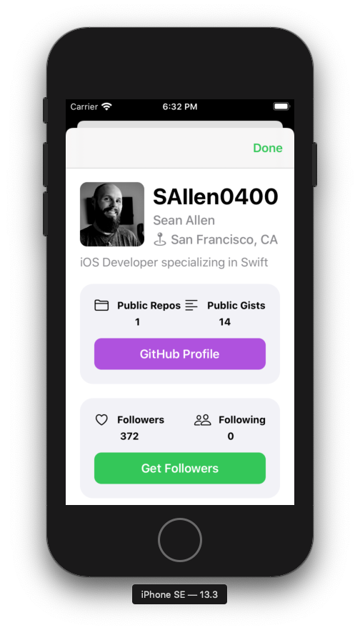
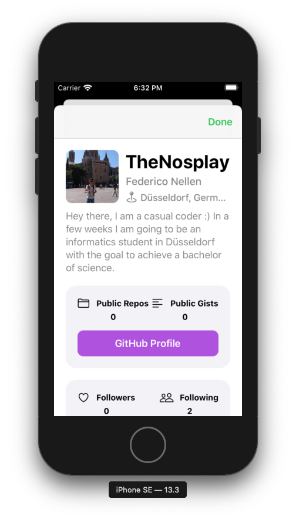

# takehomeproject - GitHubFollowers

## The Project

This project is based on the course of @[Sean Allen](https://github.com/SAllen0400). The user can enter a GitHub username and the app displayes the followers of this GitHub user. It shows the profile picture of the follower and its loginname.
With a tap on a follower the app displays the users information: repos, gists, the number of followers and the number of people the user is following. The user can visit the profile of the user on GitHub in the Webbrowser inside the app itselt. To look through the followers of the user, the user of the app can press a button and the app displays them in the same way as before.
The user can also safe users and accsess their follower. After the app closes these saved users will not be deleted.

**!!This is not my code. The base project is from @[Sean Allen](https://github.com/SAllen0400)!!**

**My changes to the project are:**
- the dynamic height of the GFUserInfoVC using preferredContentSize and the dynamic apating ScrollView height in the UserInfoVC. 
- diffrent flow of the favourites screen: When the user tapps on a favourited user it first shows the UserInfoVC and then he can choose to look at the followers etc.
- the FollowerListVC loads all of the followers, to be able to search trough all of them

## Sneak Peak
</img> </img> </img> </img> </img> </img> </img> </img>         

# The code I wrote

## Dynamic Height

The code to calculate the height of a UILabel. Found this on [StackOverflow](https://stackoverflow.com/questions/25180443/adjust-uilabel-height-to-text)

*UIHelper extension*
```swift
static func heightForUILabel(text:String, font:UIFont, width:CGFloat) -> CGFloat{
        let label:UILabel = UILabel(frame: CGRect(x: 0, y: 0, width: width, height: CGFloat.greatestFiniteMagnitude))
        label.numberOfLines = 0
        label.lineBreakMode = NSLineBreakMode.byWordWrapping
        label.font = font
        label.text = text

        label.sizeToFit()
        return label.frame.height
}
```
*GFHeaderInfo extension*
At first I calculated the height of the the bioLabel when the ViewController is beeing initialised. 
_(The hardcoded numbers are the padding used for the layout)_

```swift
func updateLabelFrameSizes(){
        let widthLabelsRight : CGFloat = view.frame.width - padding - avatarImageViewHeight - textImagePadding
        bioLabelFrameHeight = UIHelper.heightForUILabel(text: user.bio ?? "No Bio available", font: UIFont.preferredFont(forTextStyle: .body), width: view.frame.width - 40)
        nameLabelFrameHeight = UIHelper.heightForUILabel(text: user.name ?? "", font: nameLabel.font!, width: widthLabelsRight)
        usernameLabelFrameHeight = UIHelper.heightForUILabel(text: user.login, font: nameLabel.font!, width: widthLabelsRight)
        locationLabelFrameHeight = UIHelper.heightForUILabel(text: user.location ?? "GitHub" , font: nameLabel.font!, width: (widthLabelsRight - 5))
}
    
```

After that I calculated the ```preferredContentSize```.

```swift
func updatePrefferedFrameSize(){
        preferredContentSize = CGSize(width: view.frame.width, height: avatarImageViewHeight + textImagePadding + padding + bioLabelFrameHeight)
}
```

*UserInfoVC extension*
_(The hardcoded numbers are the padding used for the layout)_

First give the scrollview an initial height and adjust it in the function configureUIElemts

```swift
func configureScrollView(){
        view.addSubviews(scrollView)
        scrollView.addSubviews(contentView)
        
        scrollView.pinToEdges(of: view)
        contentView.pinToEdges(of: scrollView)
        
        var contentHeight : CGFloat
        
        if DeviceTypes.isiPhoneSE || DeviceTypes.isiPhone8Zoomed{
            contentHeight = 280 + 69 + 44 + 100
        }else{
            contentHeight = view.frame.height
        }

        NSLayoutConstraint.activate([
            contentView.widthAnchor.constraint(equalTo: scrollView.widthAnchor),
            contentView.heightAnchor.constraint(equalToConstant: contentHeight)
        ])
    }
```

_(The hardcoded numbers are the padding used for the layout)_
```swift
func configureUIElements(with user: User){
        self.add(childVC: GFUserInfoHeaderVC(user: user), to: self.headerView)
        self.add(childVC: GFRepoItemVC(user: user, delegate: self), to: self.itemViewOne)
        self.add(childVC: GFFollowerVC(user: user, delegate: self), to: self.itemViewTwo)
        self.dateLabel.text = "GitHub since " + user.createdAt.converteToMonthYearFormat()
        
        var contentHeight : CGFloat = 0
        contentHeight =  140*2 + 50 + 80 + headerViewHeight
        scrollView.contentSize = CGSize(width: view.frame.width, height: contentHeight)
    }

```

Only adjust the height of the container if it is a headerView
```swift
func add(childVC: UIViewController, to containerView: UIView){
        addChild(childVC)
        containerView.addSubview(childVC.view)
        childVC.view.frame = containerView.bounds
        childVC.didMove(toParent: self)
        
        if containerView === headerView{
            containerView.updateConstraints()
            containerView.heightAnchor.constraint(equalToConstant: childVC.preferredContentSize.height).isActive = true
            headerViewHeight = childVC.preferredContentSize.height
        }
    }
```

### Images of dynamic height

Short User Biography             |  Long User Biography
:-------------------------:|:-------------------------:
iPhone 11 Pro   |  iPhone 11 Pro 
iPhoneSE   |  iPhoneSE 

## Loading all follower at once
I wanted to be able to search through all of the follower. With the pagination solution of @[Sean Allen](https://github.com/SAllen0400) you would have to scroll to the bottom of the collectionView till it loaded them all.

### Disclaimer
By using this approach it is very likely that you will hit the api limit of 60 requests per hour. You will need to authenticate to make use of 5000 requests per hour.

So here the code:

```swift
func getFollowers(username: String, page : Int){
        isloadingMoreFollowers = true

        NetworkManager.shared.getFollowers(for: username, page: page) { [weak self] (result) in
            guard let self = self else{return}
 
            switch result{
            case .success(let followers):
                self.updateUI(with: followers)

            case.failure(let error):
                self.presentGFAlertOnMainThread(title: "Bad Stuff Happend", message: error.rawValue, buttonTitle: "Ok")
                print(error.localizedDescription)
            }
            
            self.isloadingMoreFollowers = false
        }
    }
    
    func updateUI(with followers: [Follower]){
        if followers.count < 100 {
            self.hasMoreFollowers = false
            self.isloadingMoreFollowers = false
        }
        self.followers.append(contentsOf: followers)
        
        if hasMoreFollowers{
            page += 1
            getFollowers(username: username, page: page)
            self.updateData(on: self.followers)
        }
        if !isloadingMoreFollowers{
            self.updateData(on: self.followers)
        }
        if self.followers.isEmpty{
            let message = "This user doen't have any followers. Go follow them 😉."
            DispatchQueue.main.async {
                self.showEmptyStateView(with: message, in: self.view) }
            return
        }
    }
```
